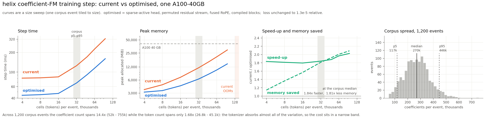

# Where the FM's step spends time and memory

Measured 2026-09-21 on S3DF, inside the current image, against the production
architecture (`configs/pimm/coeff_fm_train.py`: d=512, 12 enc, 4 dec, 8 heads,
n_bins=128, `serial=True`, gp=1024, gd=2048, 59,150,848 parameters) on real
`coeff_tpc_r1/run_0027575715` events, bf16 autocast, AdamW + clip 1.0.

Two GPUs: **A100-SXM4-40GB** (`ampere`, the production card) and **H200 141GB**
(`hopper`). torch 2.10.0+cu126.

Scripts are in `tools/profile/`; each writes a JSON next to its log. Reproduce with

    source scripts/helix_env.sh
    sbatch -A "$HELIX_SLURM_TRAIN_ACCOUNT" -q "$HELIX_SLURM_TRAIN_QOS" --gpus 1 -o <log> \
      tools/profile/sbatch_run.sh p1_shapes_step.py

Raw JSON for every table is under
`$HELIX_EXP/profiling/out/` (A100) and `out_h200/` (H200), with the slurm logs
beside them in `logs/`.

Read §9 first if you only want the conclusion.

---

## 1. The batch, in numbers

64 real events:

| | value |
|---|---|
| cells (tokens) per event | mean **32,501**, median 32,200, min 27,570, max 39,539, p95 37,694 |
| active coefficients per event | mean 285,800 |
| slot occupancy (`occ`) | **6.87 %** of the (cell, 128-slot) grid |
| `valid` slots | 99.75 % |
| bytes per event, as collated | **62.8 MiB** |

Where those bytes go, for a 32,210-cell event:

| key | MiB | dtype | used by the categorical path? |
|---|---|---|---|
| `occ` | 15.73 | float32 (N, 128) | yes |
| `inp` | 15.73 | float32 (N, 128) | yes |
| `tgt` | 15.73 | float32 (N, 128) | yes |
| `valid` | 3.93 | bool (N, 128) | yes |
| `band`, `cell`, `slot` | 6.06 | int64 (264,628) | **no** |
| `dead` | 1.97 | float32 (N, 16) | **no** (dead_frac=0) |
| `val`, `target` | 2.02 | float32 (264,628) | **no** |
| `cell_key`, `cell_wb`, `cell_tb` | 0.74 | int64 (N) | **no** |
| the rest (`band_id`, `plane_id`, `t_phys`, `wire_pos`, `wirefeat`) | 0.9 | | yes |

**≈ 11 MiB of every event — 18 % — is carried through tokenize, collate and
H2D for the sparse `losses()` path that `n_bins > 0` never takes.** Dropping the
unused keys measured 63.8 → 52.4 MiB/event and H2D 3.1 → 2.6 ms (§6).

---

## 2. Memory: one event, one A100

Stage by stage, forward only, 32,210 cells (`p1`):

| stage | peak allocated | added by this stage |
|---|---:|---:|
| mask | 293 MiB | 0.2 |
| `forward_feat` (12 enc + 4 dec) | 4,475 MiB | **4,182** |
| `occ_head` | 4,404 | 47 |
| `val_head` | 6,457 | **2,061** |
| `losses_cat` | 8,590 | **3,139** |
| backward | **10,552** | 2,026 |

Full step peak **9,904 MiB allocated / 13,424 MiB reserved**. That is why only
**4.2 events fit on a 40 GB A100** (`p4`, binary search to OOM: 137,500 cells).

### The categorical head is half the memory, and 23.7× redundant

`val_head` is `Linear(512, n_slot × n_bins) = Linear(512, 16384)`. Its output is
`(n_cells, 128, 128)` and `losses_cat` runs `cross_entropy` over all of it.
Measured cost per logit element: **10.1 bytes** — bf16 logits (2) + autocast's
fp32 upcast of `cross_entropy` (4) + the saved `log_softmax` (4). At 32k cells
that is **4.8 GiB, 51 % of the step's peak**.

But the value loss weights only `occ & valid & masked`:

| | |
|---|---|
| grid slots | 3,910,272 |
| slots the loss weights | 165,324 (**4.23 %**) |
| logit elements computed | 500,514,816 |
| logit elements needed | 21,161,472 (**1 / 23.7**) |

Confirmed by ablation: `n_bins=32` instead of 128 drops the 32k-cell step from
9,389 → 5,610 MiB and 120.5 → 105.6 ms, and the difference divides out to
exactly the 10.1 B/element above.

### Everything else

`n_bins=0` (Gaussian NLL) at 32k cells: 4,463 MiB. Trunk alone (no head, no
loss): 4,582 MiB. So the trunk costs **0.143 MiB/cell** and the categorical head
**0.150 MiB/cell** — the head is as expensive as the entire 16-block
transformer.

---

## 3. Device time: 70 % of it is not arithmetic

`p5` runs instrumented copies of `uniform_attn` / `grouped_cross` / `_self` /
`_cross` (checked bit-identical to `serial.py` before measuring) under
`torch.profiler`. Kernel time by class, one step, 30,549 cells:

| class | ms/step | % |
|---|---:|---:|
| GEMM | 57.69 | **25.0** |
| elementwise | 54.53 | 23.6 |
| copy / cat / memcpy | 38.49 | 16.7 |
| index / gather / scatter | 20.71 | 9.0 |
| LayerNorm | 13.57 | 5.9 |
| optimizer | 11.35 | 4.9 |
| flash attention | 10.91 | **4.7** |
| reductions | 9.29 | 4.0 |
| softmax / cross-entropy | 8.44 | 3.7 |
| sort | 3.45 | 1.5 |

**GEMM + attention is 29.7 % of device time.** The other 70 % is plumbing.
(Profiler overhead inflates absolute values; the shares are what to read.)

Forward only, by phase — the trunk is 60.3 ms of a 70.8 ms forward:

| phase | ms | % of trunk |
|---|---:|---:|
| `apply_rope` | **19.01** | **31.5** |
| grouped-attention gather + pad | 8.45 | 14.0 |
| MLP | 8.37 | 13.9 |
| unnamed (emb, `_sched` argsorts, `at[vis]`, `index_copy`) | ~13.2 | 21.9 |
| LayerNorm + qkv | 3.36 | 5.6 |
| SDPA (self) | 3.15 | 5.2 |
| attention out-projection | 2.34 | 3.9 |
| SDPA (cross) | 1.65 | 2.7 |
| grouped-attention scatter | 0.79 | 1.3 |
| heads | 3.83 | — |
| loss | 6.59 | — |

**RoPE application costs more than the MLP and ~4× the attention it feeds.**
Two reasons, both fixable:

* `apply_rope` recomputes `cos(ang)`/`sin(ang)` and two `repeat_interleave`s on
  every one of its 32 calls per forward, from angle tensors that are constant
  across layers.
* `ang` is fp32, so `v * c` promotes bf16 activations to **fp32**, doubling the
  traffic for q and k in every block before SDPA casts them back down.

---

## 4. Host time: 59 % of a one-event step is size-independent

The same step at shrinking token counts (`p12`, A100):

| n_cells | step ms |
|---:|---:|
| 500 | 74.62 |
| 1,000 | 74.78 |
| 2,000 | 74.29 |
| 4,000 | 77.87 |
| 8,000 | 80.58 |
| 16,000 | 84.74 |
| 32,000 | **125.55** |

**74.6 ms of a 125.6 ms one-event step does not depend on the token count at
all** — 59 %. This is host-side issue cost, and at one event most of it is
*hidden* behind GPU execution rather than added to it — see §5b before drawing
any conclusion about batching from this number. The step issues **4,007 `cudaLaunchKernel`** calls (plus 441
`cudaMemcpyAsync`, 448 `cudaMemsetAsync`), and this node's raw launch cost is
**7.07 µs/kernel**, so launches alone account for ≈28 ms; the rest is Python,
aten dispatch (≈20,600 aten calls/step) and autograd graph construction.

Top self-CPU per step: `cudaLaunchKernel` 24.6 ms, `aten::copy_` 8.5 ms (1,416
calls), `cudaStreamSynchronize` 6.9 ms (77 calls), `aten::empty` 5.5 ms,
`aten::empty_strided` 5.0 ms.

### The 77 host synchronisations, located

`p9` runs the step under `torch.cuda.set_sync_debug_mode("warn")`:

| count | site |
|---:|---|
| 36 | `serial.py:21` — `uniform_attn`'s `b[T:] = x[order[-1]]` (3 per block × 12) |
| 12 | `serial.py:33` — `grouped_cross`'s same line (3 per block × 4) |
| 13 | `loss.py:104,113,114` — `bucketize_bins`' `int(band_id.max())` and `if sel.any()` |
| 16 | `serial.py:126-142` — `nonzero`, `unique`, mask draws |

`x[order[-1]]` indexes with a **0-d** CUDA tensor, which calls `.item()`.
`x[order[-1:]]` is the same value with no sync. Removing all 48 of them measured
**120.98 → 120.73 ms** — i.e. essentially nothing, because the GPU already has
120 ms of queued work. They become worth removing only after §7 shrinks the GPU
side, and the fix is one character each.

> A caution for anyone repeating this: **comparing "CPU issue time" to wall time
> cannot detect launch-bounding here.** Each of those 77 syncs blocks the host
> until the device catches up, so the two always agree to ~2 ms regardless. The
> token-count sweep above is the measurement that actually separates them.

---

## 5. The scaling curve — and MULTI_EVENT_BATCHING.md's premise on this hardware

`MULTI_EVENT_BATCHING.md` §2 measured 20.2–22.0 µs/cell on an RTX 2080 Ti, flat
by 4,000 cells, and concluded batching buys no throughput. §8 says to re-measure
if training moves to A100/H100. It did. (`p2`, production config, fwd+bwd:)

| n_cells | A100 ms | A100 µs/cell | A100 peak MiB | H200 ms | H200 µs/cell |
|---:|---:|---:|---:|---:|---:|
| 2,000 | 68.2 | 34.11 | 975 | — | — |
| 8,000 | 71.8 | 8.98 | 2,623 | 28.2 | 3.52 |
| 16,000 | 75.5 | 4.72 | 4,883 | 39.7 | 2.48 |
| **32,000** | **120.5** | **3.77** | **9,389** | **63.1** | **1.97** |
| 64,000 | 221.6 | 3.46 | 18,401 | 108.9 | 1.70 |
| 128,000 | 359.4 | 2.81 | 21,383 | 197.8 | 1.54 |
| 256,000 | 636.2 | 2.49 | 33,904 | 305.3 | 1.19 |
| 768,000 | OOM | | | 853.6 | 1.11 |

The saturation point moved from ~4,000 cells to **~16,000–24,000** on A100. One
event (32.5k) is now only 1.4–2× past it, not 8–10×, so the per-cell cost is
still falling at one event: 3.77 µs/cell at 32k against a 2.49 µs/cell asymptote.

So the document's *conclusion* survives but its *margin* does not: on A100 there
is a real ~1.5× of per-token efficiency between one event and a very large pack
— the flat-curve argument no longer covers it. What replaces the argument is §8:
once packing is done correctly it is worth **1.37×**, and two changes that need
no batching at all are worth **1.30×** between them.

---

## 5b. Why a bigger batch does nothing: the GPU is not idle

The obvious objection to §5 is that with enough memory, K events should cost far
less than K single-event steps. They do not, and the reason is not subtle once
measured (`p14`).

**A single event already occupies the GPU 85-95 % of the time.**

| | ms/step | NVML utilisation | kernel time / wall |
|---|---:|---:|---:|
| production, K=1 | 121.4 | 94.9 % (p10 94.0) | **85.0 %** |
| optimised (sparse head + bf16 RoPE), K=1 | 97.8 | 89.3 % (p10 88.0) | 77.3 % |
| optimised, event-aware pack K=4 | 370.1 | 97.4 % (p10 96.0) | **95.6 %** |

The idle fraction *is* the ceiling on any batching gain, and at K=1 it is 5-15 %.
Measured gain at K=6: **1.06×**. Batching captured essentially all of the
headroom there was, and there was not much.

An independent check with no batching in it at all: run two single-event steps
concurrently on two CUDA streams.

    one event                 122.9 ms
    two events, one stream    267.6 ms
    two events, two streams   263.5 ms      1.016x

If the GPU had spare capacity, overlapping two independent steps would find it.
It finds 1.6 %.

### Why one event is enough to saturate it

**Because "batch" and "tokens" are the same axis here, and the cost is linear in
that axis.** The grouped attention has a fixed group size (gp=1024, gd=2048), so
attention is O(N·g), not O(N²); everything else is O(N·d²). One event is a
32,500-row GEMM, which these kernels already run at full efficiency. A second
event makes it a 65,000-row GEMM. Nothing about the first event's work becomes
cheaper. This is the opposite of an image model, where batch is a *separate*
dimension and a batch of 1 leaves most of the device unused.

**The only genuinely per-step cost is the optimizer**, and it is small:

| | fwd+bwd | opt + clip | step | per-step share |
|---|---:|---:|---:|---:|
| production, K=1 | 123.0 | 7.50 | 127.1 | 5.9 % |
| optimised, K=1 | 93.5 | 7.46 | 97.8 | **7.6 %** |
| optimised, pack K=4 | 365.8 | 7.44 | 370.2 | 2.0 % |
| optimised, sequential accumulation K=4 | 408.2 | 7.44 | 412.5 | 1.8 % |

Amortising 7.46 ms over 4 events predicts **1.026×**; measured **1.057×**. The
2-3 % difference is the small idle fraction above. That is the whole mechanism —
there is no third term.

(A side result in that table: sequential *accumulation* of 4 events costs 408 ms
against 4 × 93.5 = 374 ms for four independent steps. Accumulating into an
existing `.grad` rather than assigning a fresh one costs ~8.5 ms/event at 59 M
parameters. Prefer more ranks over accumulation where you have the choice.)

### And the §4 floor is not GPU time

§4 reports a 74.6 ms size-independent floor. It would be easy to read that as
74.6 ms of serial per-step cost waiting to be amortised by a bigger batch. It is
not: it is **host-side issue cost that already overlaps with GPU execution**. The
proof is in §5's table — the H200 runs the same 32,000-cell step in **63.1 ms**,
below the A100 node's 74.6 ms "floor", which is impossible if that floor were
serial work the GPU had to wait through. It is kernel launch and dispatch, and
at one event it hides behind 120 ms of GPU work. What leaks past it is the 5-15 %
idle, and that leaks because of the 77 host synchronisations chopping the
pipeline (§4), not because the host is too slow overall.

### The capacity that IS being wasted is not idle time

The GPU is ~95 % *occupied* and ~25-30 % *efficient*: §3 measures GEMM + flash
attention at **29.7 %** of device time, with the remaining 70 % in memory-bound
plumbing — RoPE rebuilding the same cos/sin tables in all 32 calls and promoting
bf16 to fp32, the gather/scatter of the grouped reordering — and in work that
should not exist at all, like the 23.7× redundant logits of §2.

**Batching multiplies occupied-but-wasteful work. It cannot recover any of it.**
That is the whole reason the two source fixes are worth 1.30× while six events
are worth 1.06×: one deletes work, the other schedules the same work differently.

Note the second row of the utilisation table: after the fixes, idle rises from
15 % to 23 %, because GPU work shrank while the host cost did not. So packing
becomes marginally *more* attractive as the kernels get better — and it is still
only ~1.06 % per event per doubling, for 4-6× the memory. If you want that 23 %
back, cut the 4,007 launches and the 77 syncs; do not add events.

## 6. The data path is not the bottleneck

`p8`, real reader → `CoeffTokenize` → collate → pinned H2D → step, shuffled:

| workers | wait for data | H2D | GPU | step | ev/s |
|---:|---:|---:|---:|---:|---:|
| 0 | 208.3 ms | 3.2 | 139.2 | 350.6 | 2.85 |
| 2 | 3.1 | 3.0 | 156.2 | 162.4 | 6.16 |
| **4** (production) | **1.2** | 3.1 | 150.1 | 154.4 | 6.48 |
| 8 | 0.5 | 3.1 | 165.4 | 169.0 | 5.92 |
| 16 | 0.7 | 3.9 | 160.8 | 165.4 | 6.05 |
| 4, model keys only | 0.3 | 2.6 | 149.5 | **152.4** | 6.56 |
| 4, no pin_memory | 16.2 | 8.7 | 140.1 | 165.0 | 6.06 |

`num_worker = 4` is right and the loader is fully hidden. Two things worth
knowing:

* single-event CPU cost is 24 ms read + 59 ms tokenize **sequentially**, but
  **208 ms under a shuffled order** — random shard access, not compute. Four
  workers cover it; one does not, and `num_worker` has ~7× less headroom than
  the sequential number suggests.
* `pin_memory=False` costs 25 ms/step. pimm's loader sets it; don't unset it.

---

## 7. Interventions, measured

All against the same event (30,549 cells), A100, loss and gradients checked.
`base` here excludes `opt.step()`, so it reads 116.9 ms rather than 125.6.

| variant | ms | peak MiB | vs base |
|---|---:|---:|---|
| base (production) | 116.91 | 9,001 | — |
| **sparse-active head (`head_bmm`)** | **100.88** | **4,974** | **1.16× faster, 0.55× memory** |
| chunked head + checkpoint | 132.06 | 4,970 | 0.89×, 0.55× |
| slot-loop sparse head | 172.79 | 4,561 | 0.68×, 0.51× |
| block activation checkpointing | 161.50 | 5,757 | 0.72×, 0.64× |
| sparse head + block checkpointing | 145.16 | **1,825** | 0.81×, **0.20×** |

**Token ceiling on one 40 GB A100** (binary search to OOM):

| | max cells | ≈ events |
|---|---:|---:|
| base | 137,500 | 4.2 |
| sparse-active head | 257,750 | 7.9 |
| sparse head + block checkpointing | >595,375 | >18.3 |

On H200 the same three are 493,625 / >595,375 / >595,375 cells (the search
stopped at 600k).

### The sparse-active head

`head_bmm` computes `val_head` and the cross-entropy **only at the (cell, slot)
pairs the loss weights**: group the active pairs by slot, pad each slot-group to
the batch maximum, and do one `baddbmm` + one `cross_entropy` — four kernels,
not `4 × n_slot`. The arithmetic is the same sum; only the summation order and
the GEMM shape change.

| mask mode | masked | active slots | Δloss | max rel Δgrad | dense → sparse |
|---|---:|---:|---:|---:|---|
| random | 0.753 | 0.0429 | −5.6e−5 | 7.5e−3 | 121.4 → 106.3 ms |
| plane | 0.277 | 0.0181 | −3.6e−5 | 7.9e−3 | 197.0 → 179.2 ms |
| plane_any | 0.207 | 0.0146 | +4.8e−5 | 7.8e−3 | 206.4 → 189.6 ms |

The 7.5e−3 gradient difference is **not** the head. Re-running the *identical*
dense step twice differs by **6.2e−3** on the same metric: SDPA's backward
accumulates with atomics, so the step's own gradients are nondeterministic at
that level. (The loss is bit-identical on a dense re-run; only the backward
moves.) Dense-vs-sparse 6.9e−3 sits inside dense-vs-dense 6.2e−3.

A side finding in that table: **a plane-masked step costs 1.6–1.7× a
random-masked one**, because the encoder runs on the *visible* set and plane
masking hides only 21–28 % of tokens against random masking's 75 %. At
`plane_frac = 0.1` that is ≈ +7 % on the average step — a real cost of the
masking choice `docs/SCIENCE.md` shows is worth +0.160.

### RoPE

`p9`, same event, against a single reference forward (the optimizer is built
with `lr=0` so every variant is compared to the same weights):

| variant | ms | max abs deviation | speedup |
|---|---:|---:|---:|
| shipped | 120.63 | 0 | 1.000 |
| cos/sin computed once per forward, fp32 | 118.97 | **0** (bit-exact) | 1.014 |
| cos/sin once per forward, cast to bf16 | 109.46 | 2.9e−3 | **1.102** |
| `torch.compile(apply_rope)` | 116.32 | 2.5e−3 | 1.037 |
| both | 114.68 | 2.3e−3 | 1.052 |

Caching the tables is free and exact but worth little on its own; **the 10 % is
in not promoting bf16 activations to fp32**, which is not bit-exact (2.9e−3 on
features of magnitude ~1.45, ≈0.2 %) and therefore a retrain-boundary decision,
not a drop-in.

### torch.compile, and the container

`torch.compile(model)` fails in the image with `ModuleNotFoundError: No module
named 'setuptools'`. The venv is uv-built and carries **no `pip`, `setuptools`,
`pkg_resources` or `wheel`** — `ninja` and `triton` ARE present, which is why
compiling a single Triton-only function works while compiling the model (which
reaches Inductor's wrapper build) does not.

`p13` puts a setuptools wheel on `sys.path` and re-measures, so the cost of the
gap is a number rather than a guess:

| | ms | peak MiB | vs its own eager baseline | warmup |
|---|---:|---:|---:|---:|
| eager base | 121.33 | 9,658 | — | — |
| `compile(model, dynamic=True)` | 114.58 | **6,565** | **1.06×, 0.68× memory** | 68 s |
| eager + sparse head + bf16 RoPE | **93.58** | **5,432** | **1.30×, 0.56× memory** | — |
| `compile(model)` + bf16 RoPE | 107.61 | 6,566 | 1.02× over eager+RoPE | 48 s |
| `compile(model.forward_feat)` | 119.03 | 9,508 | 1.02× | 15 s |
| compiled, 3 event sizes round-robin | 117.92 /event | | 1.09× over eager 128.52 | 17 s |

So the missing `setuptools` costs **about 6 %** and a memory option that the
sparse head supersedes. It is worth fixing — it is one line, and −32 % memory
for free is not nothing — but it is **not** the large lever this document's
first draft assumed, and it does not stack: once RoPE is fixed in source,
compile adds 2 %, because fusing that elementwise chain was most of what it was
buying. Dynamic shapes are not the problem — round-robin over three event sizes
keeps 1.09× with no recompile storm.

Dynamo does break the graph inside `bucketize_bins`, on the
`int(band_id.max()) >= n_band` guard (`loss.py:104`). The guard is there for a
documented reason; hoisting it out of the step would close the break.

### Things that did not help

| | |
|---|---|
| fused AdamW + `foreach` clip | 1.02× |
| removing `clip_grad_norm_` entirely | 1.00× |
| removing the 48 `x[order[-1]]` syncs | 1.002× (see §4) |
| `compile(model.forward_feat)` alone | 1.02× |

---

## 7b. What the 70 % actually was — and 1.456x of it removed

§5b says the recoverable capacity is wasted *work*, not idle *time*. That is a
claim about causes, so here are the causes, each measured and each removed. All
of it is in `tools/profile/p15..p20`; the end state is validated against five
real events.

### (i) The grouped attention re-permutes the data four times per block

`uniform_attn` gathers q, k and v into padded group layout (three gathers of
`(T, d)`) and scatters the output back (one scatter). But **LayerNorm, qkv, the
projection, the MLP and the residual add are all row-wise** — none of them cares
what order the tokens are in. So the residual stream can simply be *carried* in
permuted, padded form, and the only cost per block is one gather that composes
the previous block's permutation with this one's:

    src_i[p] = inv_{i-1}[ order_i[min(p, T-1)] ]

Four passes per block become one. The pad rows are duplicates of the block's
last real token and stay duplicates through the block, which is why this is the
identical computation — **verified bit-exact, max|Δ| = 0**, and the encoder alone
goes 65.12 → 51.35 ms fwd+bwd (**1.268×**).

**The decoder is worse, and it is the bigger half.** With `mask_ratio = 0.75` the
encoder sees 7,625 tokens and the decoder processes 22,919 queries against 7,625
keys. All four `CrossBlock`s call `grouped_cross` with the **same** `oq` and
`okv` — so the query set is gathered 4 times, the key/value set 8 times, and the
output scattered 4 times, always by the same permutation. Permuting once before
the loop and back after leaves 2 gathers and 1 scatter for the whole decoder.

### (ii) apply_rope runs at 3-10 % of the memory roofline

Isolated, on the real shapes, against this card's measured 1,285 GiB/s:

| | shipped | hand-fused | `torch.compile` | roofline |
|---|---:|---:|---:|---:|
| encoder, 7,625 tok, fp32 | 0.342 ms (**6.6 %**) | 0.198 (11.5 %) | **0.148** | 0.023 |
| encoder, bf16 | 0.358 (**3.2 %**) | 0.136 (8.3 %) | 0.146 | 0.011 |
| decoder q, 22,919 tok, fp32 | 0.698 (**9.7 %**) | 0.571 (11.9 %) | **0.268** | 0.068 |
| decoder q, bf16 | 0.725 (**4.7 %**) | 0.338 (10.1 %) | 0.271 | 0.034 |

The shipped form is ~14 kernels per call over strided views: `cos`, `sin`, two
`repeat_interleave`, a negate, a `stack` over `v[..., 1::2]` / `v[..., 0::2]`,
two muls and an add — **per half** — then a `cat`. Rewritten over a
`(T, h, hd/2, 2)` view with one cos/sin table covering both halves (time
frequencies for the first `hd/4` pairs, wire for the rest) it is 7 contiguous
kernels, no `repeat_interleave`, no `cat`, and the same arithmetic in the same
order — **bit-exact in fp32**. `torch.compile` on that fused form is better
again, and it works in the image today (it is *model*-level compile that needs
the missing setuptools, not function-level).

flash_attn 2.8.3 ships a fused rotary that matches helix's interleaved
convention (`apply_rotary_emb(..., interleaved=True)`). It is exact to 4.8e-7 in
fp32 and 2.1× the hand-fused form on the decoder tensor (0.294 vs 0.571 ms), but
it carries a ~0.27 ms floor independent of size, so it loses on the encoder's
smaller tensor and loses to `torch.compile` overall. Recorded because it is the
obvious thing to reach for and it is not the right answer here.

### (iii) The residual stream is fp32 inside a bf16 autocast run

Dumped dtypes through one encoder block:

| | dtype |
|---|---|
| `embed` (Linear) | bfloat16 |
| FiLM gamma, after FiLM | bfloat16 |
| **`band_emb` (nn.Embedding)** | **float32** |
| **`_emb()` out = the residual stream** | **float32** |
| LayerNorm out | float32 |
| qkv (Linear) out | bfloat16 |
| `rope_angles`, and q,k after `apply_rope` | **float32** |
| SDPA out, proj out | bfloat16 |
| **`x + proj(o)` (residual)** | **float32** |

`nn.Embedding` is not on autocast's bf16 list, so `x + band_emb + plane_emb`
returns fp32, and from then on `x = x + proj(o)` keeps the stream fp32 for all
16 blocks — twice the bytes of the largest tensor in the model, plus a cast at
every residual add. Carrying it in bf16 is worth a further ~1.03×, but it is
**not** bit-exact (max|Δ| 1.2e-1), so it belongs to a new run, not a patch.

### (iv) A quarter of the head path is multiplied by zero

At `vis_w = 0`, `losses_cat` masks the BCE by `tok_mask[:, None]` and the value
term by `... & mrow`: **no visible row enters the objective**. Yet `forward_feat`
builds `zeros(N, d)`, does two `index_copy`s, LayerNorms all N rows, and both
heads run over all N. For training (not for the probe, which wants every row)
the visible quarter can be dropped outright.

### The result

Cumulative, one A100, 30,549-cell event, against the shipped step:

| | ms | peak MiB | speedup | memory |
|---|---:|---:|---:|---:|
| A shipped | 121.76 | 9,757 | 1.000 | 1.00× |
| B + permuted encoder | 113.81 | 9,988 | 1.068 | 1.01× |
| C + permuted decoder | 107.32 | 9,892 | 1.133 | 1.00× |
| D + sparse-active head | 91.04 | 6,869 | 1.337 | 0.63× |
| F + masked-only head path | 90.17 | 6,799 | 1.350 | 0.62× |
| **H + compiled fused RoPE** | **83.64** | **5,673** | **1.456** | **0.58×** |
| I + bf16 residual stream | 81.89 | 5,711 | 1.487 | 0.59× |

A-D-F-H change no arithmetic that matters. Validated on five real events:

| event | n_cells | shipped loss | H loss | relative |
|---|---:|---:|---:|---:|
| 0 | 30,549 | 5.559710 | 5.559702 | −0.0001 % |
| 1 | 39,343 | 5.559415 | 5.559392 | −0.0004 % |
| 2 | 28,918 | 5.559183 | 5.559136 | −0.0008 % |
| 3 | 38,233 | 5.559780 | 5.559766 | −0.0003 % |
| 4 | 35,254 | 5.560331 | 5.560301 | −0.0005 % |

That residue is fp32 summation order in the sparse head, and it is two orders of
magnitude below the step's own backward nondeterminism (§7).

Kernel classes, before and after (CUDA-only profile, so these are clean shares):

| class | A shipped | H best |
|---|---:|---:|
| elementwise | 48.86 ms (43.6 %) | 32.65 (38.5 %) |
| GEMM | 34.19 (30.5 %) | 29.57 (34.9 %) |
| index / copy | 8.93 (8.0 %) | 8.87 (10.5 %) |
| softmax / cross-entropy | 3.80 (3.4 %) | **0.34 (0.4 %)** |
| kernels launched per step | **4,898** | **2,529** |

Ceiling on one 40 GB A100: **3.1 → 8.0 events**. Utilisation stays ~90 %: the
step got faster by doing less, not by waiting less.

**What is still on the table.** GEMM is 29.6 ms of 84.8 ms of kernel time, so
roughly another 2× exists if the remaining elementwise were fused. The biggest
single item left is RoPE — even compiled it runs at ~25 % of roofline, and a
hand-written Triton kernel would close most of that. Beyond that it is the MLP's
`(P, 2048)` intermediate and the fp32 residual stream, i.e. exactly what a
whole-model `torch.compile` would fuse, which is the argument for §9 item 3.

## 7c. What should be inside a compiled region and is not

`torch.compile(model)` on the shipped code was measured at 1.06x (§7) and that
looked like the end of it. It is not: the reason it buys so little is that
**Inductor never sees a whole block**.

    torch._dynamo.explain(model.forward)     33 graphs, 32 breaks, 287 ops

Thirty-three fragments. Almost every break is `aten._local_scalar_dense` — a
`.item()` — from `x[order[-1]]` inside `uniform_attn` and `grouped_cross`
(three per block, §4), plus `aten.nonzero` from the visible/masked indexing.
Fusion cannot cross a graph break, so the elementwise chain that is 43 % of
device time is handed to Inductor in pieces small enough that there is nothing
to fuse.

**A block in the permuted form traces to one graph.** The same rewrite that
removes the 48 host syncs (§7b (i)) removes the `.item()` that was breaking the
graph:

| traced unit | graphs | breaks | ops |
|---|---:|---:|---:|
| `model.forward` (shipped) | **33** | **32** | 287 |
| `_self_perm` (one encoder block) | **1** | **0** | 31 |
| `blk.mlp` | 1 | 0 | 4 |
| `model._sched` | 1 | 0 | 10 |
| `model.make_mask` | 1 | 0 | 2 |
| `head_masked` / `head_bmm` | 6 | 5 | 34 |
| `losses_cat` (dense) | 4 | 3 | 12 |

So the answer to "what should be compiled that isn't" is **the transformer
block**, and it is the largest remaining item:

| compiled unit (on top of the §7b fast path) | ms | peak MiB |
|---|---:|---:|
| eager fast path | 90.64 | 5,789 |
| + `rope_fused` | 84.31 | 5,791 |
| + `blk.mlp` only | 90.16 | 5,790 |
| + encoder block (`_self_perm`) | 80.72 | 5,695 |
| **+ encoder AND decoder block** | **71.62** | 5,608 |
| + head/loss only | 88.52 | **5,289** |
| + blocks + rope | 71.53 | 5,604 |
| **+ blocks + rope + head** | **70.48** | **5,104** |
| + `capture_scalar_outputs=True` | 71.28 | 5,287 |

Three things worth reading off that table:

* **Compiling the MLP alone is worthless** (90.64 → 90.16). It is already two
  GEMMs and a GELU; there is nothing to fuse across. The gain comes from taking
  the *whole block* — LayerNorm, the qkv chunk, RoPE, the residual add, the
  second LayerNorm, the MLP, the second residual — as one region.
* **The decoder block matters more than the encoder block** (80.72 → 71.62),
  which is the §7b (i) point again: at `mask_ratio = 0.75` the decoder carries
  three times the encoder's tokens.
* **The head/loss is worth compiling for memory, not speed** (−9 % peak, no
  time). It still breaks five times on `nonzero`, `bincount` and `.item()`;
  `capture_scalar_outputs=True` does not help.

**Most of it needs no container change, but not all.** `torch.compile` on the
BLOCK and on `rope_fused` works in the image today, forward *and* backward, with
`setuptools` absent — verified (`p22`); those regions lower to pure Triton.
Compiling the **head** does not: its `bincount`/`nonzero`/`cross_entropy` mix
sends Inductor down `torch.utils.cpp_extension`, which imports `setuptools`, and
the compile raises `InductorError: ModuleNotFoundError: No module named
'setuptools'`. In practice the head compile is worth ~2 % of step time (it is
the memory that it buys), so the no-container-change path gets essentially the
whole gain — see §7d. Whole-model compile needs setuptools too, and remains the
worse option.

Two breaks are worth closing at the source rather than tolerating:

* `loss.py:104,113` — `int(band_id.max()) >= n_band` and `if sel.any()` in
  `bucketize_bins`. That is a validation guard, not arithmetic, and it is in the
  hot path of every step. Hoisting it to `set_bins` removes three breaks and 13
  host syncs.
* `serial.py:21,33` — `x[order[-1]]`. Already removed by §7b (i).

The `nonzero` breaks in `forward_feat` and the sparse head are genuinely
data-dependent and are not worth fighting.

### End to end

| | ms/event | peak MiB |
|---|---:|---:|
| shipped, eager | 121.8 | 9,757 |
| §7b source fixes, eager | 90.6 | 5,789 |
| **§7b + compiled blocks, RoPE and head** | **70.5** | **5,104** |

**1.73x and 0.52x memory.** Under real shape churn — five different events round
robin, `dynamic=True` — the compiled path holds **77.18 ms/event against eager
97.56** (1.26x), for an 18.5 s warmup. Dynamic shapes cost about 10 % against a
single fixed event and do not trigger a recompile storm.

## 7d. Before and after, as a function of event size

`p23`, one A100-40GB, preemptable. **before** = the shipped step. **after** =
§7b's source changes plus §7c's compiled blocks, RoPE and head. A third column,
`after*`, leaves the head eager — the configuration that runs in the image as it
is today, with no container change.

Loss is checked at every point; the largest relative difference anywhere in the
sweep is **1.3e-5**.

### A cell is not a coefficient

These are two different quantities and the distinction decides the whole cost
model, so it is worth being exact (`helix/model/tokenize.py::assemble`).

A **coefficient** is one surviving wavelet coefficient — a row
`(band, plane_gid, wire, tau, value)` out of the DSP, after the coherent gate and
after bands `>= n_bands` are dropped.

A **cell is the model's TOKEN**: a `pw x pt = 16-wire x 8-tick` patch of one
`(plane, band)` that contains **at least one** surviving coefficient.
`assemble` computes `key = (plane_gid, band, wire // 16, tau // 8)` and
`n_cells = len(unique(key))`. Every cell carries `n_slot = 16 x 8 = 128` slots;
the coefficients inside it fill some of them and the rest are zero.

So the ratio between them is **occupancy**, and it is low and variable: mean
6.87 % of slots, i.e. ~8.8 coefficients per cell. Coefficients clustered into few
patches give few tokens; the same coefficients spread out give many. Across the
24 corpus events:

| | range | spread |
|---|---|---|
| cells (tokens) | 27,570 - 39,343 | **1.43×** |
| coefficients | 93,161 - 515,057 | **5.53×** |
| coefficients per cell | 3.37 - 13.66 | 4.05× |

### Which one you pay for — and the optimisation changes the answer

Raw correlations are useless here because cells and coefficients are themselves
correlated: bigger events have more of both. Fitting BOTH on the 24 corpus
events separates them.

| | per 1,000 cells | per 1,000 coefficients | R² |
|---|---:|---:|---:|
| **current**, step time | **+2.76 ms** (t = 7.0) | +0.004 ms (t = 0.4) | 0.990 |
| **current**, peak memory | **+269 MiB** (t = 29.2) | +0.35 MiB (t = 1.4) | 0.999 |
| **optimised**, step time | −1.04 ms (t = −0.7) | **+0.074 ms** (t = 1.9) | 0.725 |
| **optimised**, peak memory | +58.9 MiB (t = 2.0) | **+2.46 MiB** (t = 3.1) | 0.980 |

**The current path costs cells and ignores coefficients; the optimised path does
the opposite.** That is not a curiosity, it is the sparse-active head (§7b) doing
exactly what it was built to do: the dense head computes `n_cells x 128 slots x
128 bins` of logits no matter how few of those slots hold anything, so occupancy
is free to it; the sparse head computes one row per ACTIVE `(cell, slot)` pair,
which *is* the coefficient count.

The cleanest demonstration is three corpus events within **1.1 % in cells** but
**1.32× in coefficients**:

| cells | coefficients | current step |
|---:|---:|---:|
| 27,570 | 104,767 | 110.6 ms |
| 27,632 | 93,161 | 112.4 ms |
| 27,886 | 122,708 | 115.2 ms |

Ordered by cells the times are monotone. Ordered by coefficients they are not
(112.4, 110.6, 115.2).

**Design consequence.** Under the current code, anything changing how many
coefficients SURVIVE — `tau`, the coherent gate, the noise model — is nearly free
at training time, while anything changing the CELL count — `pw`, `pt`,
`n_bands`, the patch geometry — is what costs. `COEFF_CORPUS_DESIGN.md` treats
those as one knob; for cost they are not. After the optimisation the sensitivity
inverts, and a corpus generation with a looser gate becomes measurably more
expensive to train on.

### The corpus's own spread — 1,200 events

Everything else here uses 24 events; `p25` tokenises 1,200 spread evenly across
the run, which is what the figure's last panel plots.

| | p5 | median | p95 | min - max | spread |
|---|---:|---:|---:|---:|---:|
| **cells (tokens)** | 28,254 | 32,064 | 36,946 | 26,813 - 45,077 | **1.68×** |
| **coefficients** | 117,118 | 270,073 | 446,042 | 52,252 - 754,697 | **14.4×** |
| coefficients per cell | 4.1 | 8.4 | 12.2 | 1 - 16 | 16× |

**The coefficient count varies 14.4× across the corpus; the token count varies
1.68×.** The tokenizer absorbs almost all of the variation, which is why the cost
of an event sits in such a narrow band — and why, on the current code, changing
how many coefficients survive is close to free.

### The curves are a size sweep, not corpus events

The figure's curves come from `common.synth_from`: one corpus event's cell-space
arrays tiled and truncated to a target token count, with the active-coefficient
rows rebased. It preserves shapes, dtypes, per-cell slot occupancy, the
band/plane label mix and the valid fraction; it does not preserve coordinate
uniqueness, so `_sched`'s argsorts tie heavily and the RoPE tables carry
duplicate rows. It is cost-faithful and physics-meaningless, and it is used for
cost questions only. Every correctness result in this document — the
bit-exactness checks (§7b), the five-event loss validation, the gradient
comparison (§7), the busy-fraction measurements (§5b), the packing measurements
(§8) — rests on corpus events alone.

The control for "cost-faithful" is the overlap:

| | step time | peak memory | speedup |
|---|---:|---:|---:|
| size sweep, N = 32,000 | 125.2 ms | 11,457 MiB | 1.841 |
| corpus ev18, N = 32,166 | 125.5 ms | 11,439 MiB | 1.853 |
| **agreement** | **0.22 %** | **0.16 %** | |

It exists because the corpus spans only 1.68× in tokens, and four claims here
cannot be made in a 1.68× window: the saturation knee (§5, needs 2k-256k), the
size-independent floor (§4, needs N = 500), the OOM ceiling (needs to go past a
corpus event), and the fixed-vs-marginal memory split (needs the 80× span to
separate the ~900 MiB of parameters and optimizer state from the per-token cost).
It holds occupancy fixed at its source event's 7.30 coefficients per cell, so it
says nothing about the cells-vs-coefficients table above; that is what the corpus
events are for.

`tools/profile/p24_figure.py` draws `docs/img/fig_step_cost.png`; `tools/profile/p25_dist.py`
produces the distribution.

### 24 real events, 27.6k to 39.3k cells (93k to 515k coefficients)

| coefficients | cells | before ms | after ms | speedup (after / after*) | before MiB | after MiB | mem |
|---:|---:|---:|---:|---:|---:|---:|---:|
| 93,161 | 27,632 | 112.4 | 69.9 | 1.607 / 1.606 | 10,175 | 5,766 | 0.567 |
| 122,708 | 27,886 | 115.2 | 67.9 | 1.695 / 1.675 | 10,258 | 5,802 | 0.566 |
| 198,661 | 30,314 | 120.3 | 70.9 | 1.696 / 1.665 | 10,924 | 6,125 | 0.561 |
| 223,020 | 30,549 | 121.6 | 70.1 | 1.734 / 1.695 | 10,977 | 6,156 | 0.561 |
| 264,628 | 32,210 | 125.6 | 68.9 | 1.823 / 1.776 | 11,450 | 6,297 | 0.550 |
| 270,009 | 32,166 | 125.5 | 67.7 | **1.853** / 1.806 | 11,439 | 6,300 | 0.551 |
| 334,250 | 33,328 | 131.0 | 84.4 | 1.552 / 1.515 | 11,835 | 6,771 | 0.572 |
| 394,626 | 35,254 | 135.7 | 82.2 | 1.651 / 1.602 | 12,362 | 6,954 | 0.563 |
| 478,319 | 36,922 | 138.2 | 81.7 | 1.692 / 1.632 | 12,766 | 7,127 | 0.558 |
| 496,404 | 39,343 | 147.2 | 82.2 | 1.790 / 1.723 | 13,465 | 7,369 | 0.547 |
| 515,057 | 37,719 | 142.7 | 85.8 | 1.663 / 1.602 | 13,028 | 7,314 | 0.561 |

(11 of 24 rows; the full set is in `p23_before_after.json`.)

Across all 24: **speedup 1.55-1.85, memory 0.547-0.572.** The banding — the
~1.85 group sits at 32k cells, the ~1.55 group at 33-34k — is the grouped
attention's padding: `npad = ceil(T/g)*g` at gp=1024, so an event just over a
group boundary carries up to 1,023 wasted rows through twelve blocks. The
optimised path inherits that (it is the same contract) but pays it once per
block instead of four times, which is why the ratio moves with it.

### Synthetic scaling, to 2.4M coefficients

| coefficients | cells | before ms | after ms | speedup | before MiB | after MiB | mem |
|---:|---:|---:|---:|---:|---:|---:|---:|
| 41,450 | 4,000 | 80.8 | 44.1 | 1.833 | 3,618 | 3,163 | 0.874 |
| 73,579 | 8,000 | 81.7 | 45.0 | 1.813 | 4,668 | 3,422 | 0.733 |
| 161,046 | 16,000 | 84.5 | 47.0 | 1.796 | 6,934 | 4,421 | 0.638 |
| 246,056 | 32,000 | 125.2 | 68.0 | 1.841 | 11,457 | 6,319 | 0.552 |
| 395,931 | 48,000 | 171.7 | 91.4 | 1.879 | 15,961 | 8,298 | 0.520 |
| 481,299 | 64,000 | 226.2 | 115.0 | 1.967 | 20,464 | 10,200 | 0.498 |
| 714,099 | 96,000 | 325.2 | 160.4 | **2.027** | 29,450 | 14,090 | **0.478** |
| 945,868 | 128,000 | **OOM** | 205 | — | — | 18,0xx | — |
| 1,418,958 | 192,000 | **OOM** | 292 | — | — | — | — |
| 1,884,940 | 256,000 | **OOM** | 383 | — | — | — | — |
| 2,370,692 | 320,000 | OOM | OOM | — | — | — | — |

Both ratios improve with event size, for the same reason: the fixed cost —
59.2 M parameters plus gradients plus two Adam moments, ~900 MiB, and the
per-step optimizer time — is a shrinking share. At a 4,000-cell event the memory
ratio is only 0.874 because that fixed 900 MiB dominates; by 96,000 cells it is
0.478, i.e. the *marginal* cost per token has roughly halved.

**The token ceiling doubles.** The shipped path OOMs at 128,000 cells (946k
coefficients, ~3.9 events); the optimised path runs to 256,000 (1.88M
coefficients, ~7.9 events) and OOMs at 320,000.

### The headline

| | |
|---|---|
| real events, all 24 | **1.55-1.85× faster** (mean 1.74), **0.55-0.57× memory** |
| without any container change (`after*`) | 1.52-1.96× (mean 1.70) |
| large events (96k cells) | 2.03× faster, 0.478× memory |
| one 40 GB A100 holds | 3.9 → 7.9 events |
| loss | unchanged to ≤1.3e-5 relative, everywhere |

For scale: the production 8-GPU run at 121 ms/step becomes ~70 ms. A 24-hour
job becomes ~14 hours, on the same hardware, training the same model on the same
data.

## 7e. The architecture itself, and how it scales

Everything above optimises the current shape. This section asks what the shape
costs and what a bigger one would cost. All of it is measured on the optimised
path (`p26`, `p27`, `p28`), at the corpus median token count (32,064 cells) so
architecture is isolated from data variation.

### Where the 59.2 M parameters are

| component | params | share |
|---|---:|---:|
| encoder blocks (12) | 37.83 M | 64.0 % |
| decoder blocks (4) | 12.61 M | 21.3 % |
| `val_head` (d x n_slot x n_bins) | 8.41 M | **14.2 %** |
| input embed (2 x n_slot -> d) | 0.13 M | 0.2 % |
| FiLM conditioner | 0.10 M | 0.2 % |
| `occ_head`, embeddings, norms | 0.07 M | 0.1 % |

Per block, encoder and decoder are the same size — attention 1.05 M, MLP 2.10 M.
The MLP is two thirds of every block, which is what makes `ffn_mult` a cheap
capacity axis below.

### Where the FLOPs are

Analytic MAC count at the production point, checked against measured time:

| | GMAC fwd | share |
|---|---:|---:|
| encoder, linear | 287.8 | 40.4 % |
| decoder, linear | 256.4 | 36.0 % |
| encoder, attention | 95.9 | 13.5 % |
| decoder, attention | 59.7 | 8.4 % |
| heads | 12.5 | 1.7 % |

**Attention is 21.9 % of the arithmetic**; the position-wise linear layers are
76 %. That is a consequence of the grouped design: attention is `O(N.g)` with a
fixed group size, not `O(N^2)`, so context reach is a linear cost here, not a
quadratic one.

Note the asymmetry. The encoder has **three times the blocks** of the decoder and
**64 % of the parameters**, but sees only the visible 25 % of tokens; the decoder
has 21 % of the parameters and does 36 % of the linear work, because it runs over
the masked 75 %. Per parameter, a decoder block does about three times the work
of an encoder block.

### Where the memory is

At d=512, 30,549 cells, optimised path, peak 5.7 GiB:

| | MiB |
|---|---:|
| resident state (params + grads + 2 Adam moments, all fp32) | 1,106 |
| forward activations (encoder + decoder + heads) | 3,967 |
| loss | 846 |
| backward working set | 257 |

### Scaling, one axis at a time

From the production point, fixed 32,064-cell batch. `M/ms` and `M/GiB` are
parameters bought per unit of step time and per unit of peak memory — higher is
better.

| axis | config | params | ms | peak MiB | state | activations | M/ms | M/GiB |
|---|---|---:|---:|---:|---:|---:|---:|---:|
| **width** | d=384 | 34.9 M | 67.8 | 4,733 | 1,217 | 3,516 | 0.52 | 7.6 |
| | **d=512** | **59.2 M** | **89.0** | **6,124** | 1,600 | 4,524 | 0.66 | 9.9 |
| | d=768 | 126.5 M | 134.2 | 9,169 | 2,621 | 6,548 | 0.94 | 14.1 |
| | d=1024 | 218.9 M | 190.3 | 12,535 | 4,011 | 8,524 | 1.15 | 17.9 |
| | d=1536 | 479.4 M | 326.4 | 20,317 | 8,003 | 12,314 | 1.47 | 24.2 |
| | d=2048 | 840.5 M | 492.8 | 29,420 | 13,497 | 15,923 | **1.71** | **29.3** |
| **encoder depth** | enc=6 | 40.2 M | 67.5 | 4,904 | | | 0.60 | 8.4 |
| | enc=24 | 97.0 M | 133.6 | 8,553 | | | 0.73 | 11.6 |
| | enc=48 | 172.6 M | 222.8 | 13,426 | | | 0.77 | 13.2 |
| **decoder depth** | dec=2 | 52.8 M | 74.5 | 5,227 | | | 0.71 | 10.4 |
| | dec=8 | 71.8 M | 118.4 | 7,939 | | | 0.61 | 9.3 |
| | dec=16 | 97.0 M | 177.2 | 11,551 | | | **0.55** | **8.6** |
| **ffn_mult** | F=2 | 42.4 M | 80.7 | 5,130 | | | 0.53 | 8.5 |
| | F=8 | 92.7 M | 105.4 | 8,093 | | | 0.88 | 11.7 |
| **n_bins** | K=32 | 52.8 M | 87.4 | 5,860 | | | | |
| | K=256 | 67.6 M | 90.9 | 6,477 | | | | |
| **group gp/gd** | 512/1024 | 59.2 M | 84.4 | 6,125 | | | | |
| | 2048/4096 | 59.2 M | 97.9 | 6,124 | | | | |
| | 4096/8192 | 59.2 M | 115.9 | 6,124 | | | | |

Marginal cost of capacity, from the production point:

| move | +params | +time | +memory |
|---|---:|---:|---:|
| d 512 -> 768 | +67.3 M | **0.67 ms/M** | 45 MiB/M |
| d 768 -> 1024 | +92.5 M | **0.61 ms/M** | 36 MiB/M |
| ffn_mult 4 -> 8 | +33.6 M | **0.48 ms/M** | 59 MiB/M |
| encoder 12 -> 24 | +37.8 M | 1.18 ms/M | 64 MiB/M |
| decoder 4 -> 8 | +12.6 M | **2.31 ms/M** | 144 MiB/M |

**Width is the best axis and the decoder is the worst** — adding decoder depth
costs 3.5x as much time per parameter as adding width, because the decoder runs
over three times as many tokens. That agrees with the MAE literature's asymmetric
encoder/decoder and with what this model is for: the encoder's representation is
what the probe reads.

`ffn_mult` is the cheapest axis of all per parameter, which follows from the MLP
being two thirds of a block and pure GEMM. It does not carry muP the way width
does, so it is a capacity knob rather than a scaling law.

### Scaling up is cheaper than linear, because utilisation improves

| | params | ms | TFLOP f+b | TFLOP/s | % A100 bf16 peak | ms / GFLOP |
|---|---:|---:|---:|---:|---:|---:|
| d=384 | 34.9 M | 67.8 | 2.59 | 38.3 | 12.3 % | 0.0261 |
| **d=512** | 59.2 M | 89.0 | 4.27 | 48.0 | **15.4 %** | 0.0208 |
| d=768 | 126.5 M | 134.2 | 8.86 | 66.0 | 21.2 % | 0.0151 |
| d=1024 | 218.9 M | 190.3 | 15.08 | 79.2 | 25.4 % | 0.0126 |
| d=1536 | 479.4 M | 326.4 | 32.41 | 99.3 | 31.8 % | 0.0101 |
| d=2048 | 840.5 M | 492.8 | 56.28 | 114.2 | **36.6 %** | **0.0088** |

The production model is small enough that the card is memory-bound (§3): 15 % of
peak. Quadrupling the width takes it to 37 %, and the cost per unit of
arithmetic falls **2.4x**. A 14x bigger model costs 5.5x the step time, not 14x.
This is the strongest single argument for scaling width here — it is the one
change that makes the hardware work better rather than just work more.

### What binds at each scale

| | activations | state (params+grads+Adam) | binding |
|---|---:|---:|---|
| d=512 | 4,524 MiB (74 %) | 1,600 (26 %) | activations |
| d=1024 | 8,524 (68 %) | 4,011 (32 %) | activations |
| d=1536 | 12,314 (61 %) | 8,003 (39 %) | both |
| d=2048 | 15,923 (54 %) | 13,497 (46 %) | both |
| d=3072, checkpointed | 7,194 (20 %) | 29,124 (**80 %**) | **optimizer state** |

**The bottleneck migrates.** Below d~1024 activations dominate, so activation
checkpointing and the kernel work of §7b are what buy headroom. Above d~2048
they do not: once checkpointing has cut activations to a few GiB, four fp32
copies of the parameters are 80 % of the card.

With block checkpointing (`p28`, +23-25 % time):

| config | params | no ckpt | with ckpt |
|---|---:|---|---|
| d=1024 enc12 | 218.9 M | 190 ms / 12.5 GiB | 234 ms / **6.2 GiB** |
| d=1536 enc12 | 479.4 M | 326 / 20.3 | 402 / 10.8 |
| d=2048 enc12 | 840.5 M | 494 / 29.4 | 604 / 16.8 |
| d=2560 enc12 | 1.30 B | **OOM** | 850 / 25.6 |
| d=3072 enc12 | 1.86 B | **OOM** | 1141 / 36.3 |
| d=1536 enc24 | 819.4 M | 506 / 30.6 | 624 / 16.4 |
| d=2048 enc24 | 1.44 B | **OOM** | 940 / 28.3 |

**A 1.9 B-parameter model trains at batch 1 on one 40 GB A100** with the §7b
changes plus checkpointing — 31x the production model. The shipped path OOMs
above d=1536.

### The next lever after checkpointing: shard the optimizer state

The FM is pure data parallel (one event per rank, §5b), which is exactly the
case ZeRO-2 is for: shard gradients and Adam moments across ranks, keep
parameters replicated. State becomes `4P + 4P/w + 8P/w` bytes instead of `16P`.
At 8 ranks:

| | state now | state, ZeRO-2 at 8 ranks | peak |
|---|---:|---:|---|
| d=1024 | 3,341 MiB | 1,148 | 12,532 -> 10,340 |
| d=1536 | 7,315 | 2,515 | 20,318 -> 15,517 |
| d=2048 | 12,826 | 4,409 | 29,419 -> **21,002** |
| d=1536 enc24 | 12,503 | 4,298 | 30,640 -> 22,435 |

pimm has no ZeRO surface today (`FMTrainer.build_model` already subclasses for
the DDP comm hook, so it is the place it would go). It is worth nothing at
d=512 — 1.6 GiB of 6.1 — and it is the difference between fitting and not at
d>=2048 without paying checkpointing's 25 %.

### Two knobs the optimisation made cheap

* **`n_bins` is no longer a cost axis.** K=128 -> 256 now costs +1.9 % time and
  +5.8 % memory; before the sparse head, K=128 -> 32 was worth 14 % of step time
  and 40 % of memory (§2). Output resolution is now a science choice, not a
  budget one.
* **`gp`/`gd` are pure cost with zero parameters** — doubling both costs 6 %,
  then 10 %, then 18 %. `docs/SCIENCE.md` reports cross-plane as the hard axis
  and plane masking as worth +0.160, so attention reach is the knob most likely
  to be worth buying, and it is priced in time alone.

And one that is a compute knob nobody costed: **`mask_ratio` moves tokens
between the 12-block encoder and the 4-block decoder**, so it changes the step
cost by 1.56x across its useful range — 0.50 -> 124.1 ms, 0.75 -> 89.1 ms,
0.90 -> 79.6 ms. Plane masking hides only 21-28 % of tokens, which puts those
steps at the expensive end (measured 1.6-1.7x a random-masked step, §7).

### Recommended shape for the next run

Ranked by expected return per unit of measured cost, given `HANDOVER.md` already
ranks "a bigger model" second after the cooldown:

1. **Scale width, not decoder depth.** d=1024 at 12 encoder blocks is 219 M
   parameters, 190 ms and 12.5 GiB — it fits three times over on a 40 GB card
   today, runs at 25 % of peak instead of 15 %, and muP is already implemented so
   the learning rate transfers from the d=512 runs without a new sweep.
2. **Keep the decoder at 4 blocks.** It is the most expensive place to add
   capacity and the least aligned with what the probe measures.
3. **Turn on block checkpointing above d~1024**, not before; below that the 25 %
   is not worth it.
4. **Shard the optimizer state above d~2048**, where checkpointing has stopped
   helping.
5. If the science wants more cross-plane reach, **buy `gp`/`gd`** — it is priced
   in time only and attention is a fifth of the arithmetic.

## 7f. Where the fast path lives, and how to turn it on

§7b-§7d's changes are implemented on the `perf/fast-path` branch, behind one
flag, off by default:

| module | what it replaces |
|---|---|
| `helix/model/rope.py` | `layers.apply_rope` — 14 strided kernels become 7 contiguous ones, tables built once per forward instead of per call. **Bit-exact in fp32.** |
| `helix/model/fastpath.py` | `SerialFMModel.forward_feat` — the residual stream is carried permuted and padded, so a block costs one gather instead of three gathers and a scatter, and the whole decoder costs two gathers and one scatter instead of twelve and four. **Bit-exact.** |
| `helix/model/head.py` | `losses_cat` at `vis_w == 0` — the value head and its cross-entropy are evaluated only at the `(cell, slot)` pairs the objective weights. Same sum, different accumulation order. |

Turn it on by adding `fast_path=True` to a config's `model` dict; `build_fm`
applies it as an instance attribute like the other training-policy options.

**Why it is off by default.** The trunk is bit-exact, but the head's fp32
summation order is not, so a run with it on is not byte-comparable with one
without — even though the difference (<0.001 % on the loss across five real
events) is two orders of magnitude below the step's own backward
nondeterminism. That is a per-run choice, and `_TRAIN_OPTS` is where per-run
choices live.

**What it declines to do.** `FMModel._fast_train_ok` gates on the categorical
head, `vis_w == 0`, FiLM conditioning and `SerialFMModel`; `forward_feat` also
declines `return_ctx`. Every gate is a capability the fast path does not
implement, so anything else falls back rather than training a different
objective. `tests/test_fast_path.py` asserts the trunk equality as
`torch.equal`, not a tolerance.

**What it deliberately preserves.** The padding contract — `npad = ceil(T/g)*g`
with the last token duplicated and attended — is reproduced exactly, including
the `rope_tables(ang_t, None)` behaviour that leaves a disabled axis's dims
unrotated. Both are defects (`docs/REVIEW_FIELD.md` §1.1, §1.3); fixing them
changes the model, so they belong to a run, not to a speedup.

## 8. Event-aware packing: a working prototype

`tools/profile/p10_eventaware.py` implements `MULTI_EVENT_BATCHING.md` §6:
per-event padding (never a dense block-diagonal mask), event-major `_sched`,
per-event block plans for both the grouped self attention and the grouped cross
decoder. ~120 lines, all in the attention layer.

**The acceptance criterion holds: at K=1 the packed forward is bit-identical to
the shipped path (max|Δ| = 0).**

At K>1, a packed event differs from its solo forward by:

| K | max abs | max rel |
|---:|---:|---:|
| 1 | **0** | **0** |
| 2 | 1.05e−1 | 2.2e−2 |
| 4 | 1.88e−1 | 3.8e−2 |
| 8 | 2.60e−1 | 5.2e−2 |

This is **not** cross-event leakage — by construction no attention group spans
two events. It is the decoder: `grouped_cross` derives `(nb, gq, gk)` per event
exactly as it would alone, but one SDPA call needs a common block size, so
blocks are padded to the batch-wide maximum and an event's block attends a few
extra duplicates *of its own keys*. Making it exact needs either an SDPA mask
over those pads (≈150 MB of bool at K=8, and it gives up flash attention) or
bucketing events by equal `gk`. The encoder is exact at every K.

Throughput, A100, with the sparse head:

| K | cells | sequential accumulation | event-aware pack | speedup | ms/event |
|---:|---:|---:|---:|---:|---:|
| 1 | 30,549 | 117.6 ms / 7,653 MiB | 120.2 ms / 7,132 MiB | 0.98 | 120.2 |
| 2 | 69,892 | 229.7 / 9,349 | 214.3 / 13,768 | 1.07 | 107.2 |
| 4 | 137,043 | 449.9 / 9,557 | 384.2 / 24,516 | 1.17 | 96.0 |
| 6 | 204,614 | 669.3 / 9,701 | 555.8 / 35,208 | **1.20** | 92.6 |
| 7 | 234,928 | 770.0 / 9,768 | OOM | | |

Sequential accumulation gives the same global batch at **flat 9.7 GiB**.

---

## 9. What to do, ranked

Two stacks, measured end to end on A100, per event against the production step.
The first spends memory to schedule the same work differently; the second
deletes work.

**Packing (`p11`):**

| | ms/event | peak MiB | throughput | memory/event |
|---|---:|---:|---:|---:|
| production | 121.3 | 10,067 | 1.00× | 1.00× |
| + event-aware pack K=4 | 91.7 | 22,708 | 1.323× | 0.56× |
| + event-aware pack K=6 | 88.4 | 33,113 | 1.372× | 0.55× |
| + grad-accum K=4 (no pack) | 100.0 | 8,000 | 1.213× | 0.20× |

**Deleting work (`p20`, §7b) — no batching, bit-faithful:**

| | ms/event | peak MiB | throughput | memory/event |
|---|---:|---:|---:|---:|
| production | 121.8 | 9,757 | 1.00× | 1.00× |
| + sparse-active head | 91.0 | 6,869 | 1.337× | 0.70× |
| + permuted residual stream (enc + dec) | — | — | (included above) | |
| + masked-only head path | 90.2 | 6,799 | 1.350× | 0.70× |
| **+ compiled fused RoPE** | **83.6** | **5,673** | **1.456×** | **0.58×** |
| + bf16 residual stream (not bit-exact) | 81.9 | 5,711 | 1.487× | 0.59× |

**The headline: raising the per-GPU event batch is not where the win is.** Six
events packed — 33 GiB, and ~120 lines of event-separation work that is a
correctness prerequisite — is worth 1.372×. Four changes that touch no batching
at all are worth **1.456×**, take memory *down* 42 %, leave the loss unchanged to
8e-4 %, and take the 40 GB ceiling from 3.1 to 8.0 events. They also compose:
packing on top of them would start from 83.6 ms, not 121.8.

Ranked. Items 1-4 change no arithmetic that matters (§7b validates them on five
real events, loss shifted by <0.001 %) and together are worth **1.456× and 0.58×
memory**. Adding item 5 takes it to **1.73× and 0.52×** (§7c). All of that is
more than six events packed, and it costs memory instead of spending it.

1. **Sparse-active categorical head.** 1.15× on its own, 45 % less memory. The
   value head and its cross-entropy compute 23.7× more logits than the loss
   weights; group the active `(cell, slot)` pairs by slot and do one `baddbmm` +
   one `cross_entropy`. Cross-entropy drops from 3.4 % of device time to 0.4 %.
2. **Carry the residual stream permuted and padded** (§7b (i)). One gather per
   encoder block instead of three gathers and a scatter; two gathers and one
   scatter for the whole decoder instead of twelve and four, since all four
   `CrossBlock`s share `oq`/`okv`. **Bit-exact**, 1.13× on the full step and
   1.27× on the encoder alone. This is the one that needs care in review — it
   moves the padding contract into the residual stream — and it is the one the
   `tests/goldens_fm.json` golden exists to protect.
3. **Rewrite `apply_rope`** over a `(T, h, hd/2, 2)` view with one cos/sin table
   per padded layout covering both halves. 14 strided kernels become 7
   contiguous ones, bit-exact in fp32, and `torch.compile` on that form (which
   works in the image today) takes the decoder call from 0.698 to 0.268 ms.
   The shipped form runs at 3-10 % of this card's memory roofline.
4. **Skip the visible rows in the head path** when `vis_w == 0`. They are
   multiplied by zero. Free, but small on its own — take it with (1).
5. **Compile the block** (§7c). `torch.compile` on `_self_perm` / `_cross_perm`
   is worth **1.27×** on top of 1-4, needs no container change, and works
   forward and backward in the image today. It only becomes possible after (2),
   which removes the `.item()` that shatters the shipped forward into 33 graphs.
   Compile the head too (−9 % memory, no time); do not bother compiling the MLP
   alone. Hoist `bucketize_bins`' `int(band_id.max())` / `if sel.any()` guard to
   `set_bins` while you are there — three graph breaks and 13 host syncs in the
   hot path, for a check that belongs at configuration time.
   `setuptools` + `wheel` in `container/install.sh` remains worth doing for
   whole-model compile, but whole-model compile is the *worse* option here (33
   graphs, 1.06×) and is no longer on the critical path. While editing the
   container, point `TORCHINDUCTOR_CACHE_DIR` and `TRITON_CACHE_DIR` at
   node-local scratch in the site profile's `env:` block.
6. **Trim the batch dict** to the keys the categorical path reads — 18 % of
   tokenize output, collate and H2D, for nothing.
7. **Carry the residual stream in bf16** (§7b (iii)). A further ~1.03×, but
   `nn.Embedding` returning fp32 is what makes it fp32 today, and fixing it is
   a numerics change (max|Δ| 1.2e-1): new run, not a patch.
8. **Event-aware packing**, only if `batch_size_per_gpu > 1` is wanted for its
   own sake. The prototype is bit-exact at K=1 and worth ~1.06× at K=6, for 4-6×
   the memory of gradient accumulation. It is last for a reason.
9. **Block activation checkpointing** — 0.81× speed for 0.20× memory, if you
   want a much larger model or many events resident.

### What the freed memory is better spent on

With the production head, one event at batch 1 (`p7`):

| model | params | ms | peak MiB | tok/s |
|---|---:|---:|---:|---:|
| d512 × 12 (production) | 59.2 M | 120.8 | 9,454 | 252,926 |
| d512 × 24 | 109.6 M | 211.2 | 13,651 | 144,652 |
| d768 × 12 | 126.5 M | 171.0 | 12,147 | 178,693 |
| d768 × 24 | 239.9 M | 308.0 | 18,862 | 99,199 |
| d1024 × 12 | 218.9 M | 233.5 | 15,149 | 130,839 |
| d1024 × 24 | 420.5 M | 428.6 | 24,703 | 71,279 |
| d1536 × 24 | — | OOM | | |

`HANDOVER.md` ranks "a bigger model" second by expected return, and d1024 × 24
(420 M parameters, 7× production) already fits at batch 1 today. With
intervention (1) it fits comfortably; with (1) + (6) so does something
considerably larger. That is a better use of 40 GB than six events.

---

## 10. Caveats

* Every number is one A100 or one H200, batch 1 per rank, no DDP. The
  multi-node all-reduce cost is measured in `helix/integrations/pimm/trainer.py`
  and is not revisited here.
* `p5`'s absolute device times carry profiler overhead; its shares do not.
* The "CPU issue vs wall" comparison in `p3`/`p11` is reported but should not be
  read as evidence of launch-bounding — see the caution in §4. §4's token-count
  sweep is the measurement that separates the two.
* The `torch.compile` rows were produced by injecting a setuptools wheel on
  `sys.path` from one user's S3DF directory, not by rebuilding the image; that
  launcher has been removed (it is in git history). A real fix goes in
  `container/install.sh`.
* The event-aware prototype is a measurement, not a merge candidate: it lives in
  `tools/profile/`, it has no test, and the decoder's per-event exactness (§8)
  is unfinished.
